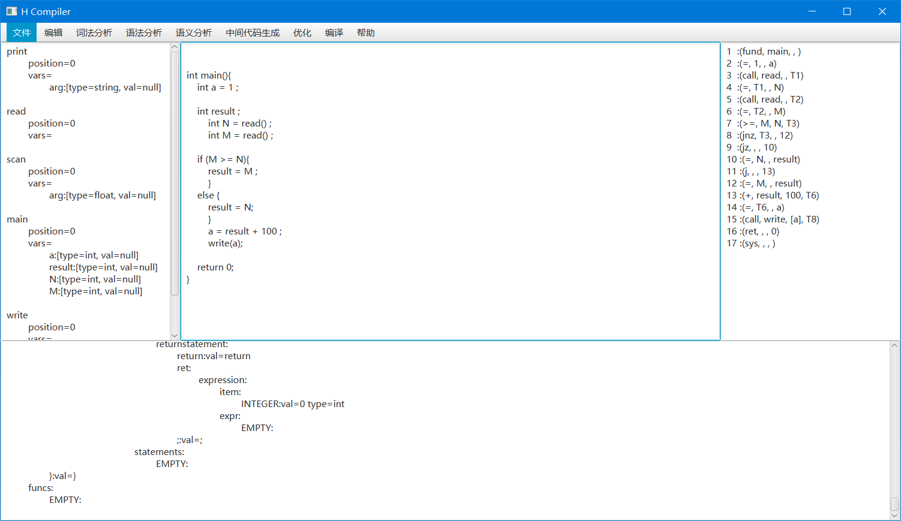

# H编译器实验


## 中间代码示例
```json
1  :(fund, main, , )
2  :(=, 1, , a)
3  :(call, read, , T1)
4  :(=, T1, , N)
5  :(call, read, , T2)
6  :(=, T2, , M)
7  :(>=, M, N, T3)
8  :(jnz, T3, , 12)
9  :(jz, , , 10)
10 :(=, N, , result)
11 :(j, , , 13)
12 :(=, M, , result)
13 :(+, result, 100, T6)
14 :(=, T6, , a)
15 :(call, write, [a], T8)
16 :(ret, , , 0)
17 :(sys, , , )

```


## 目标代码示例
下面的目标代码为以上中间代码对应生成的目标代码的示例
```json

```